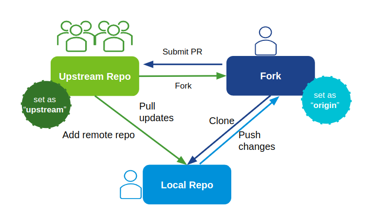
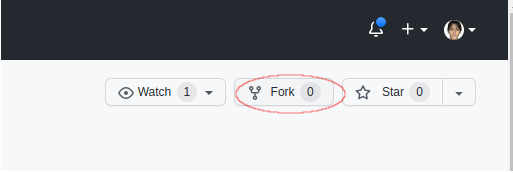
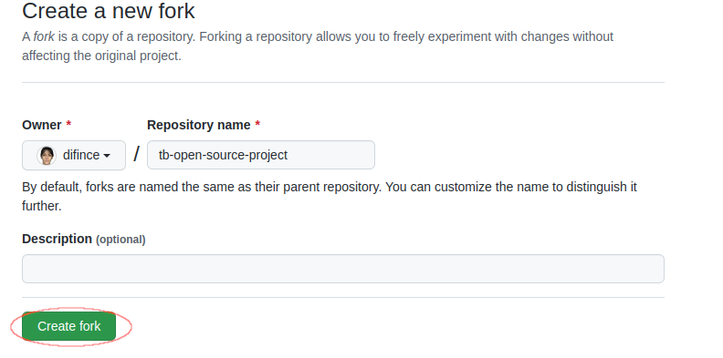
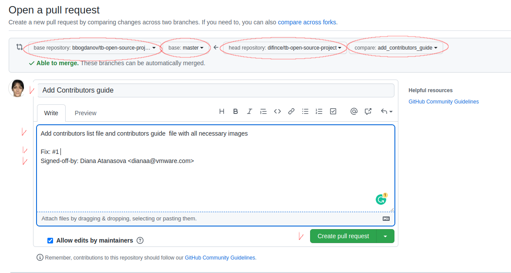

# Contributors Guide
This project aims to simplify and guide you make your first contribution to an open source project.
Use this repository to practise submitting and updating Pull Requests (PRs)
>This repository could be used as a reference.

>No-judgement, it is ok to make mistakes

## What you will learn?
- How to contribute to open source projects
- How to maintain your fork
- How to update your PR
- and more

## The Way of Work

### Learn the Terms
| Term                               | Definition                                                                                                                                                                                                                                                                                                                                                                                                                                                                                               |
|:-----------------------------------|:---------------------------------------------------------------------------------------------------------------------------------------------------------------------------------------------------------------------------------------------------------------------------------------------------------------------------------------------------------------------------------------------------------------------------------------------------------------------------------------------------------|
| Issue                              | A discussion thread tool to suggest and/or track features, bugs and other tasks for the project                                                                                                                                                                                                                                                                                                                                                                                                          |
| Upstream Repository                | The original repository                                                                                                                                                                                                                                                                                                                                                                                                                                                                                  |
| Fork                               | A copy of the Upstream repository in your account.<br/> <br/>Most commonly, forks are used to either propose changes to someone else's project or to use someone else's project as a starting point for your own idea. <br/>Forks are often used in open source development on GitHub. When you contribute in open source project you may not have permission to do commits in the original repository. So you need to fork it. By forking a repository, you are creating a copy of the repo to your account. |
| Local Repository                   | Repository copied to the local machine                                                                                                                                                                                                                                                                                                                                                                                                                                                                   |
| Pull Request (PR) or Merge Request | A way to propose your change done in your Fork to the Upstream repository                                                                                                                                                                                                                                                                                                                                                                                                                                |
| Label                              | A way to categorize issues, pull requests, and discussions.                                                                                                                                                                                                                                                                                                                                                                                                                                              |

### Workflow
When you join an open source project, you won't have direct access to push your changes into the upstream repository itself. 
So, instead, you'll need to fork the upstream repo (create a copy of the upstream repo into your GitHub account) and clone this forked repository on your local machine.
Your local repository will be configured with two remote repositories:
1. Your forked repository (set as "origin") and 
2. the upstream original repository set as "upstream" 

Then, to propose your locally done changes you push them into your forked repository and then open a "pull request" back to the original.
The diagram below show the typical workflow when contributing to an open source projects. 




## Fork the project you want to contribute to

1. Fork the repository by clicking on the fork button on the top of this page.

  

2. This will create a copy of this repository in your account.

  

## Clone your fork

Now clone the forked repository to your machine. Go to your GitHub account, open the forked repository, click on the code button and then click the _copy to clipboard_ icon.


Open a terminal and run the following git command:

```
git clone "url you just copied"
```

where "url you just copied" (without the quotation marks) is the url to this repository (your fork of this project). See the previous steps to obtain the url.


For example:

```
git clone git@github.com:<your_username>/tb-open-source-project.git
```

where `your_username` is your GitHub username. Here you're copying the contents of the `tb-open-source-project` repository on GitHub to your computer.

## Configuring a remote for a fork
```
$ git remote add upstream https://github.com/ORIGINAL_OWNER/ORIGINAL_REPOSITORY.git
$ git remote -v
```

## Fetch the remote repo
```
$ git fetch upstream
```

## Create a branch

Now create a branch using the `git checkout` command:

```
$ git checkout -b BRANCH_NAME upstream/master
```

## Do your changes and commit them
Do the changes you want to introduce. With `git status` you will see the changed files. Add those changes to the branch you just created using the `git add` command and then commit the files with appropriate commit message.
```
$ git add <files>
$ git commit -s
```
It is time to think for a good commit message

```
Commit message title; Max 50 charachters

Wrap the body at 72 characters
Separate the subject from the body with a blank line
Use the body to explain what and why vs. how

Signed-off-by: Diana Atanasova <dianaa@vmware.com>

```

## Push your change into your fork

Push your changes using the command `git push`:

```
$ git push origin BRANCH_NAME
```

replacing `BRANCH_NAME` with the name of the branch you created earlier.

### Create a Pull Request (PR)

By opening a pull request you propose to the upstream repository the changes you've made to your fork.
With your PR you ask collaborators for feedback on your changes. So be prepared to receive comments and address them.
1. Navigate to your forked repository on GitHub.
2. Above the list of files, click "Compare & Pull request".


4. Validate if the "base repository" & "head repository" are correct. Head is your repository where you have done
   your changes. Base repository is the upstream repo. Took a look if the branches are also correct.


6. Type a title and description for your pull request.
7. Submit the pull request via button "Create pull request".


### [Want to learn more?](https://github.com/difince/Git-GitHub)

